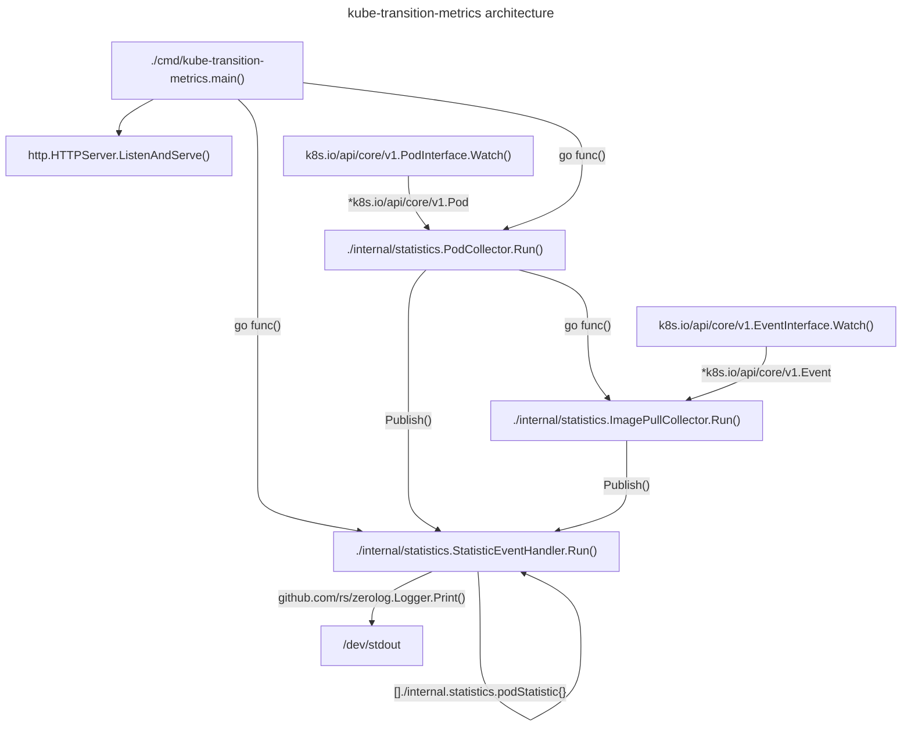

# kube-transition-metrics architecture

## Overview

This document outlines the architecture of the `kube-transition-metrics`
controller.
This controller monitors the Kubernetes Pods API to observe the life-cycle of
Pods.
Only pods created after the controller's startup are tracked, as certain metrics
can't be computed from a static snapshot of the Kubernetes API.
The Events API is also monitored to gather the `image_pull` metric type.

## Block diagram

## Goroutines

### StatisticEventHandler loop

The StatisticEventHandler goroutine reads `statisticEvent`s from a channel
written to by the PodCollector and ImagePullCollector routines.
The StatisticEventHandler manages the tracked Pods and handles `statisticEvent`s
to update these Pods in the order published.
Using a single goroutine to update the Pods statistics simplifies concurrency
control.
After processing a statistic event, it emits the statistics for the tracked pod
to stdout.

### PodCollector loop

The PodCollector goroutine receives added, modified, and deleted Pod events from
the Kubernetes API.
When Pods are added, the PodCollector sends an event to the
StatisticEventHandler to create a new tracked Pod statistic, and launches a new
ImagePullCollector routine to track Events involving the Pod UID.
When Pods are modified, the StatisticEventHandler receives an event to update
the Pod statistic.
When Pods are deleted , the StatisticEventHandler receives an event to remove
Pod statistic from tracking, and to stop the ImagePullCollector routine for this
Pod.

### ImagePullCollector loop(s)

One ImagePullCollector loop is launched by the PodCollector for each tracked
Pod.
It receives events from the Kubernetes API with the `involvedObject.uid` field
selector for the tracked Pod.
It only processes ImagePulling and ImagePulled events, and tracks the creation
timestamps of these events.
