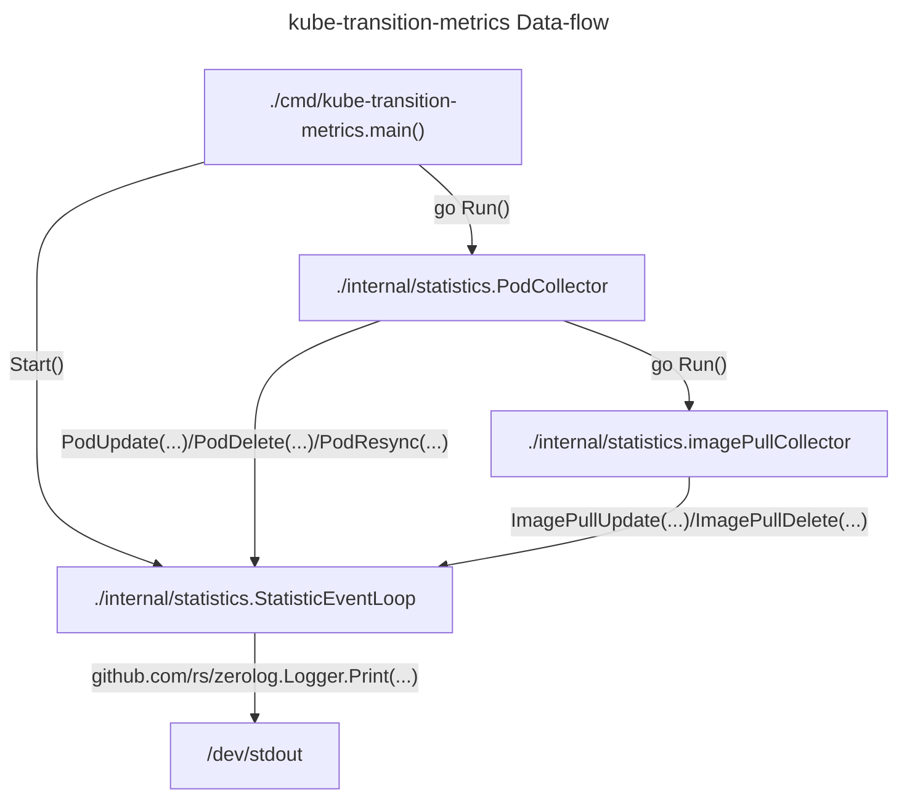
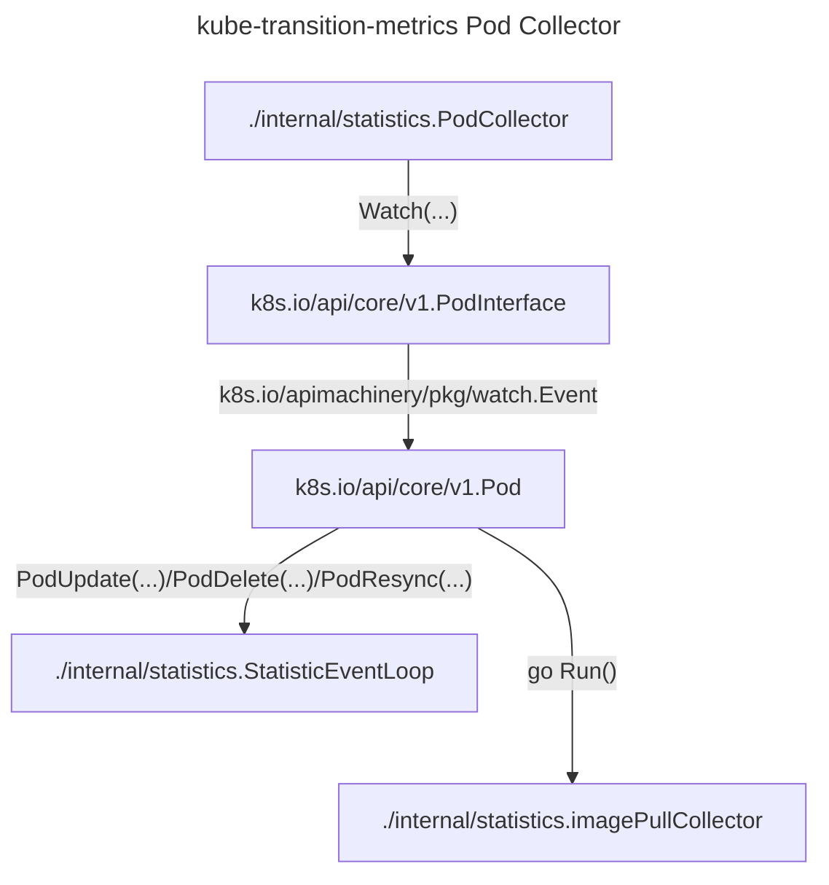
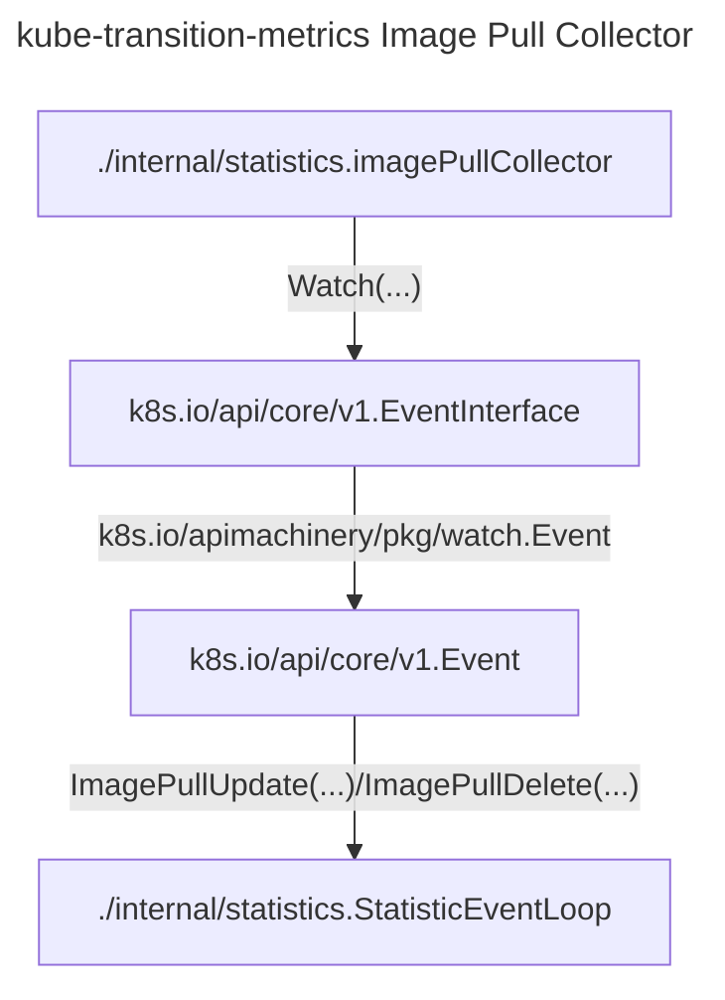
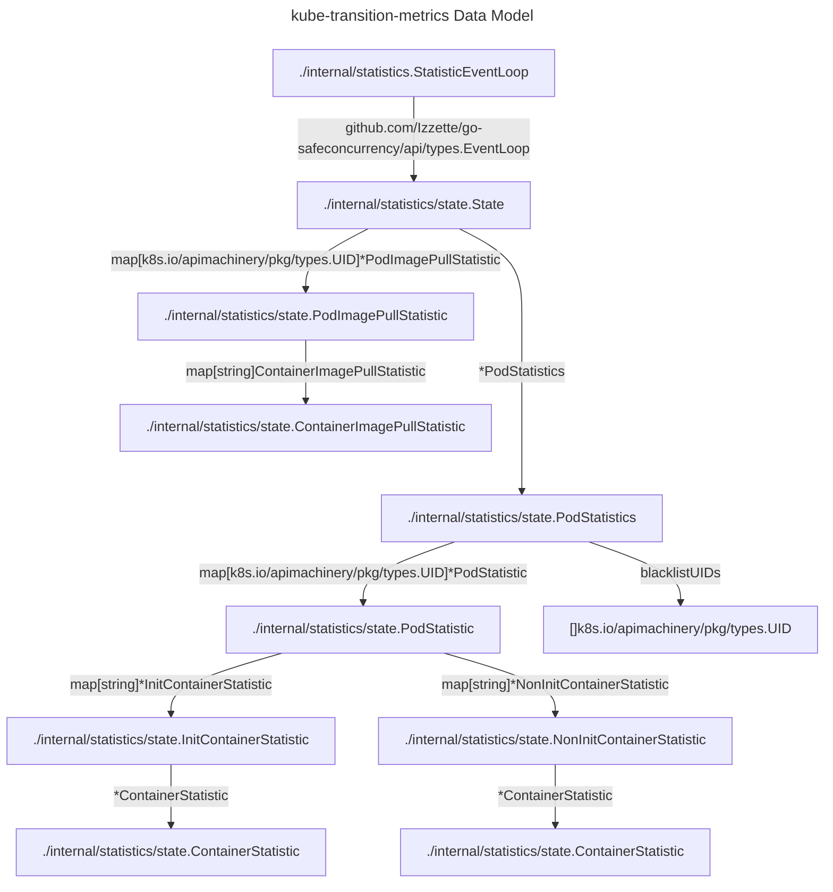
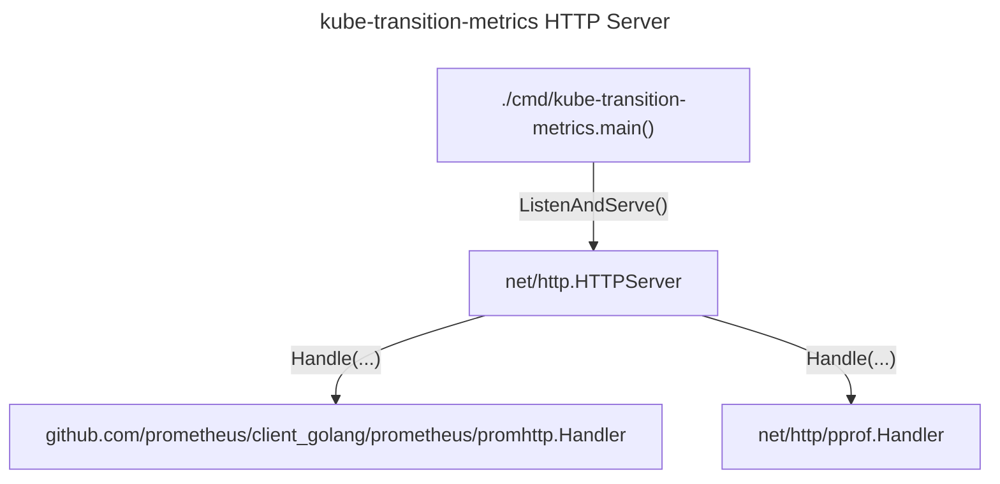

# kube-transition-metrics architecture

## Overview

This document outlines the architecture of the `kube-transition-metrics`
controller.
This controller monitors the Kubernetes Pods API to observe the life-cycle of
Pods.
Only pods created after the controller's startup are tracked, as certain metrics
can't be computed from a static snapshot of the Kubernetes API.
The Events API is also monitored to gather the `image_pull` metric type.

### Data-flow

The [`main`](../cmd/kube-transition-metrics/main.go) function starts the
[`PodCollector`](../internal/statistics/pod_collector.go) and the
[`StatisticEventLoop`](../internal/statistics/event_loop.go).
The `PodCollector` gets the list of currently existing pods.
Any pods created before the `PodCollector` starts up cannot be tracked, as we missed crucial
milestones in the pod's lifecycle.
It calls `PodResync()` on the `StatisticEventLoop` to set the pod UIDs that should not be tracked.
The `PodCollector` continues to watch all pods from all namespaces, when new pods are created it adds
the initial record to the `StatisticEventLoop` by calling `PodUpdate()`.
For each change to the pod, it records timestamps for their transitions (pod scheduled, initialized, ready)
and that of their containers (started, running, ready, etc.) by continuing to call `PodUpdate()` on the
`StatisticEventLoop`.
When pods are deleted from the cluster, the `PodCollector` will cleanup records about the pod from the
`StatisticEventLoop` by calling `PodDelete()`.

For new pods, the `PodCollector` also starts an [`imagePullCollector`](../internal/statistics/image_pull_collector.go)
to watch for Kubernetes events pertaining to the pod.
Any events the `imagePullCollector` receives about image pulling, it passes on to the `StatisticEventLoop` by calling
`ImagePullUpdate`.
When all the pods containers have started, the `imagePullCollector` is shut down, and it removes its records from
the `StatisticEventLoop`.

Every time a statistic is updated in the `StatisticEventLoop`, the latest data for that object is printed to standard out
in JSON format.

### Pod Collector zoom-in

The `PodCollector` goroutine receives added, modified, and deleted Pod events from
the Kubernetes API.
When Pods are added, the `PodCollector` sends an event to the
`StatisticEventLoop` to create a new tracked Pod statistic, and launches a new
`ImagePullCollector` routine to track Events involving the Pod UID.
When Pods are modified, the `StatisticEventHandler` receives an event to update
the Pod statistic.
When Pods are deleted , the `StatisticEventHandler` receives an event to remove
Pod statistic from tracking, and to stop the `ImagePullCollector` routine for this
Pod.

### Image Pull Collector zoom-in

One `imagePullCollector` loop is launched by the `PodCollector` for each tracked
Pod.
It receives events from the Kubernetes API with the `involvedObject.uid` field
selector for the tracked Pod.
It only processes ImagePulling and ImagePulled events, and tracks the creation
timestamps of these events.

### Data Model

### HTTP Server

