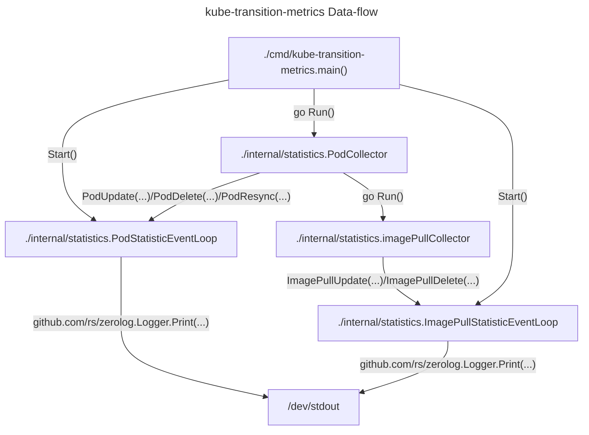
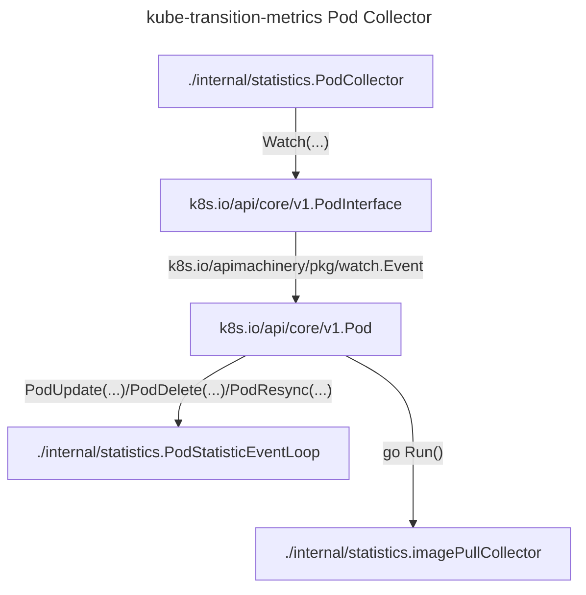
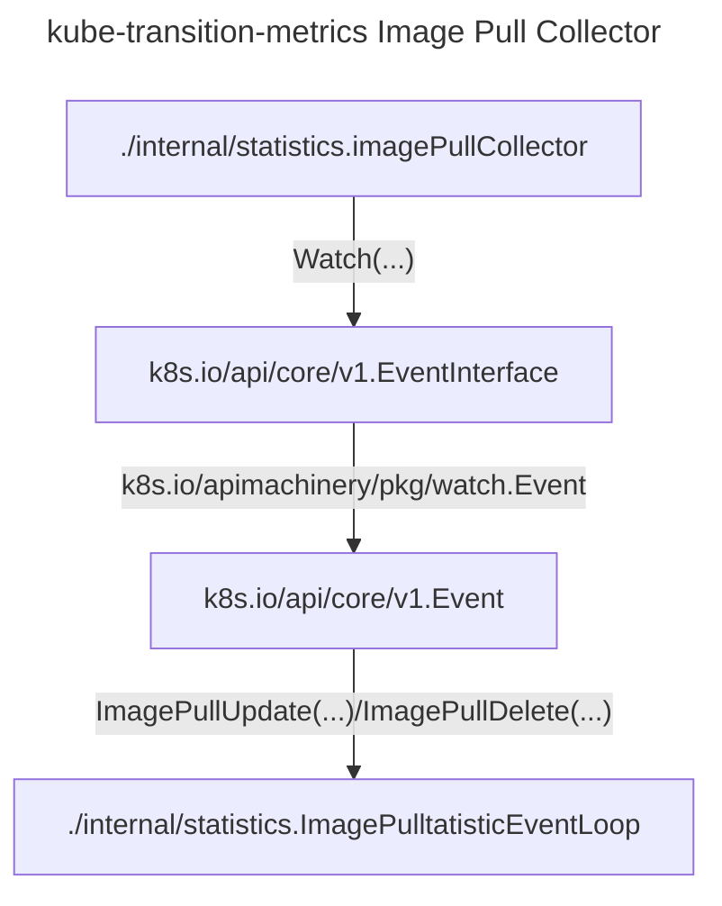
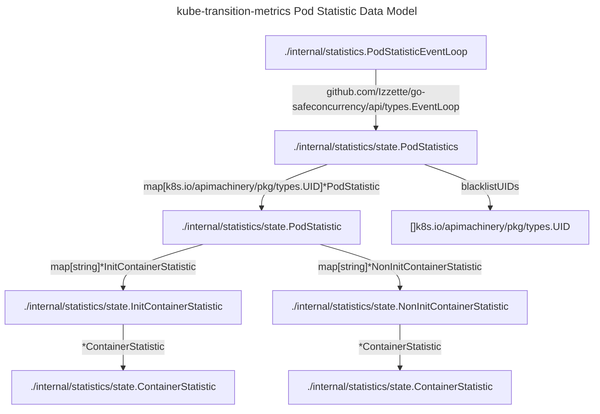
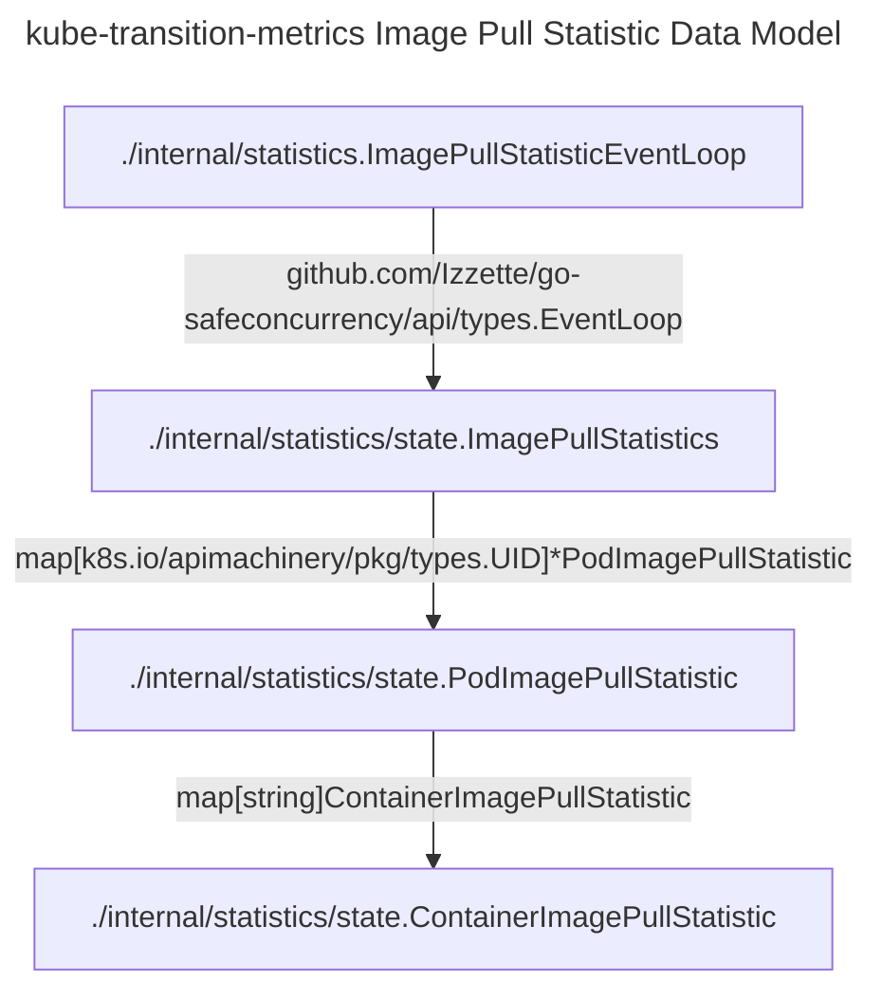
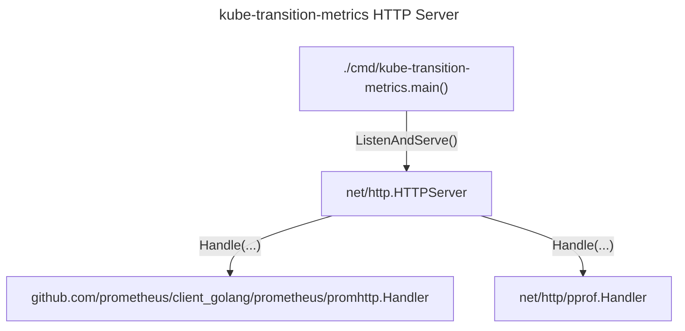

# kube-transition-metrics architecture

## Overview

This document outlines the architecture of the `kube-transition-metrics` controller.
This controller monitors the Kubernetes Pods API to observe the life-cycle of Pods.
Only pods created after the controller's startup are tracked, as certain metrics can't be computed from a static
snapshot of the Kubernetes API.
The Events API is also monitored to gather the `image_pull` metric type.

### Data-flow

The [`main`](../cmd/kube-transition-metrics/main.go) function starts the
[`PodCollector`](../internal/statistics/pod_collector.go), the
[`PodStatisticEventLoop`](../internal/statistics/event_loop.go), the
[`ImagePullStatisticEventLoop`](../internal/statistics/event_loop.go), and the HTTP server.
The `PodCollector` gets the list of currently existing pods.
Any pods created before the `PodCollector` starts up cannot be tracked, as we missed crucial milestones in the Pod's
life-cycle.
It calls `PodResync()` on the `PodStatisticEventLoop` to set the pod UIDs that should not be tracked.
The `PodCollector` continues to watch all pods from all namespaces, when new pods are created it adds the initial record
to the `PodStatisticEventLoop` by calling `PodUpdate()`.
For each change to the pod, it records timestamps for their transitions (pod scheduled, initialized, ready) and that of
their containers (started, running, ready, etc.) by continuing to call `PodUpdate()` on the `PodStatisticEventLoop`.
When pods are deleted from the cluster, the `PodCollector` will cleanup records about the pod from the
`PodStatisticEventLoop` by calling `PodDelete()`.

For new pods, the `PodCollector` also starts an [`imagePullCollector`](../internal/statistics/image_pull_collector.go)
to watch for Kubernetes events pertaining to the pod.
Any events the `imagePullCollector` receives about image pulling, it passes on to the `ImagePullStatisticEventLoop` by
calling `ImagePullUpdate`.
When all the pods containers have started, the `imagePullCollector` is shut down, and it removes its records from the
`ImagePullStatisticEventLoop`.

Every time a statistic is updated in the `PodStatisticEventLoop` or `ImagePullStatisticEventLoop` the latest data for
that object is printed to standard out in JSON format.

### Pod Collector zoom-in

The `PodCollector` goroutine receives added, modified, and deleted Pod events from the Kubernetes API.
When Pods are added, the `PodCollector` sends an event to the `PodStatisticEventLoop` to create a new tracked
[`PodStatistic`](../internal/statistics/state/pod.go), and launches a new `imagePullCollector` routine to track Events
involving the Pod UID.
When Pods are modified, the `PodStatisticEventLoop` receives an event to update the `PodStatistic`.
When Pods are deleted , the `PodStatisticEventLoop` receives an event to remove the `PodStatistic` from tracking,
then the `imagePullCollector` routine is canceled for this Pod.

### Image Pull Collector zoom-in

One `imagePullCollector` loop is launched by the `PodCollector` for each tracked Pod.
It receives events from the Kubernetes API with the `involvedObject.uid` field selector for the tracked Pod.
It only processes `ImagePulling` and `ImagePulled` events, and tracks the creation timestamps of these events.
When an `ImagePulling` or `ImagePulled` event is received, it sends an event to the `ImagePullStatisticEventLoop` to
update the associated [`ContainerImagePullStatistic`](../internal/statistics/state/image_pull.go) for the container that
triggered the image pull.
When all containers of a Pod are in the `Running` state, the `imagePullCollector` routine is canceled and the
[`PodImagePullStatistic`](../internal/statistics/state/image_pull.go) is removed from the `ImagePullStatisticEventLoop`.

### Data Model

#### Pod Statistics

The data model for the pod statistics is composed of the following main components:

- `PodStatisticEventLoop`: The main event loop that handles the [`PodStatistics`](../internal/statistics/state/pod.go)
  and has exclusive access to modify the statistics through dispatched events.
- `PodStatistics`: The statistics for all tracked pods, which contains a map of pod UIDs to their respective
  `PodStatistic` as well as a list of UIDs that should not be tracked.
- `blacklistUIDs`: A list of pod UIDs that should not be tracked, as they were created before the controller started
  running.
- `PodStatistic`: The statistics for the phase and condition transitions for a specific pod.
- [`InitContainerStatistic`](../internal/statistics/state/container.go): The statistics for the status transitions for a
  specific init container.
- [`NonInitContainerStatistic`](../internal/statistics/state/container.go): The statistics for the status transitions
  for a specific non-init container.
- [`ContainerStatistic`](../internal/statistics/state/container.go): Common statistics for both init and non-init
  containers.

#### Image Pull Statistics

The data model for the image pull statistics is composed of the following main components:

- [`ImagePullStatisticEventLoop`](../internal/statistics/event_loop.go): The main event loop that handles the
  `PodImagePullStatistic` and has exclusive access to modify the statistics through dispatched events.
- [`ImagePullStatistics`](../internal/statistics/state/image_pull.go): The statistics for all tracked pods, which
  contains a map of pod UIDs to their respective `PodImagePullStatistic`.
- `PodImagePullStatistic`: A collection of the
  [`ContainerImagePullStatistic`](../internal/statistics/state/image_pull.go) for a specific pod.
- `ContainerImagePullStatistic`: The statistics for the image pulling events for a specific container.

### HTTP Server

The HTTP server is started by the `main` function and listens on the port specified in the command line arguments.
It serves the Prometheus `/metrics` endpoint and the `/pprof` endpoint for profiling.

